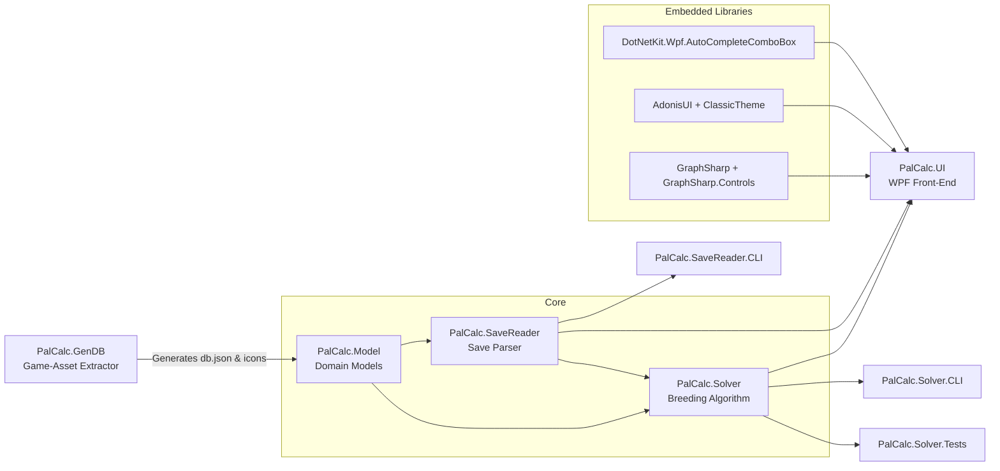

# PalCalc – Architecture  
*(Version 2025-07-02)*  

---

## 1. High-Level Component Graph  

---

## 2. Solution / Project Tree  

| Project | Output | Target Framework | Key References |
|---------|--------|------------------|----------------|
| **PalCalc.Model** | lib | `net9.0` | – |
| **PalCalc.SaveReader** | lib | `net9.0-windows` | PalCalc.Model |
| **PalCalc.Solver** | lib | `net9.0` | PalCalc.Model, PalCalc.SaveReader |
| **PalCalc.GenDB** | exe | `net9.0` | PalCalc.Model |
| **PalCalc.UI** | WinExe | `net9.0-windows10.0.17763.0` | Model, SaveReader, Solver, Embedded libs |
| **PalCalc.SaveReader.CLI** | exe | `net9.0-windows10.0.17763.0` | SaveReader |
| **PalCalc.Solver.CLI** | exe | `net9.0-windows10.0.17763.0` | Solver, SaveReader |
| **PalCalc.Solver.Tests** | test lib | `net9.0` | Solver |

---

## 3. Data-Flow Pipelines

1. **Game-Asset Extraction**
   `PalCalc.GenDB` ➜ Reads local Palworld *.pak* via **CUE4Parse**, produces:
   * `PalCalc.Model/db.json` (stats, passives, etc.)
   * Icon PNGs copied into `PalCalc.UI/Resources/Pals/*`

2. **Save Parsing**
   Player save (*.sav*) ➜ `PalCalc.SaveReader` (visitor pattern) ➜ `PalInstance` objects (domain).

3. **Breeding Optimisation**
   `PalCalc.Solver.BreedingSolver`
   * Multi-threaded; each thread explores parent pairs.
   * Strategy pattern for pruning (see `ResultPruning/*`).
   * Probabilities module computes pass-inherit/IV odds (Pascal's triangle helper).

4. **Presentation**
   `PalCalc.UI` (WPF)
   * MVVM ViewModels assemble data.
   * `GraphSharp` renders breeding tree.
   * `AdonisUI` theming + `AutoCompleteComboBox` controls.

---

## 3a. PAK File Extraction Details

### **Pal Properties** (from `PalReader.cs`)
- **Identity**: PalDexNo, PalDexNumSuffix, InternalName, LocalizedNames, Size, Rarity, Price
- **Combat Stats**: Hp, Defense, ShotAttack, Support
- **Movement**: WalkSpeed, RunSpeed, RideSprintSpeed, TransportSpeed, Stamina
- **Survival**: MaxFullStomach, FoodAmount, Nocturnal
- **Work Suitabilities**: All 12 work types (Kindling, Watering, Planting, Electricity, Handiwork, Gathering, Lumbering, Mining, Medicine, Cooling, Transport, Farming)
- **Breeding**: BreedingPower, MaleProbability, GuaranteedPassives (1-4)
- **Wild Spawn**: MinWildLevel, MaxWildLevel

### **Passive Skills** (from `PassiveSkillsReader.cs`)
- **Core**: Rank (-3 to +3), InternalName, LocalizedNames, LocalizedDescriptions
- **Effects**: EffectType1-3, TargetType1-3, EffectValue1-3
- **Inheritance**: RandomInheritanceAllowed, RandomInheritanceWeight
- **Surgery**: SurgeryCost, SurgeryRequiredItem

### **Active Skills** (from `ActiveSkillReader.cs`)
- **Combat**: WazaType, Element, Power, CooldownSeconds
- **Availability**: CanInherit, HasSkillFruit

### **Visual Assets**
- **Pal Icons**: Individual portraits (100x100 PNG)
- **Element Icons**: Type icons (Normal, Fire, Water, etc.)
- **UI Icons**: Work suitability, status, skill rank, misc icons
- **Map**: World map texture (4096x4096 JPEG) + coordinate transforms

### **Breeding Data**
- **Unique Combinations**: Special parent pairs with gender requirements
- **Complete Matrix**: All possible breeding results with probabilities
- **Optimization**: Minimum breeding steps for solver algorithms

### **Localization**
- **Multi-language**: Names, descriptions, UI text for 18+ languages
- **Format Processing**: Dynamic descriptions with effect value substitution

---

## 4. Key Design Patterns & Decisions  

| Area | Pattern / Decision | Rationale |
|------|--------------------|-----------|
| Save parsing | **Visitor** over GVAS AST | Streamed traversal keeps memory low. |
| Solver | **Strategy** pruning rules | Runtime swap/add of heuristics. |
| Solver | Custom thread-pool (manual) | Customizable thread priority, reduce UI lag under load. |
| UI | **MVVM** (CommunityToolkit) | Binding & testability. |
| Data pipeline | **Pipeline** (GenDB) | Decoupled asset steps. |

---

## 5. Critical Implementation Paths  

1. **Probability Calculations** – [`PalCalc.Solver/Probabilities/*`](relative/PalCalc.Solver/Probabilities)  
2. **Result Pruning Builder** – [`PruningRulesBuilder.cs`](relative/PalCalc.Solver/ResultPruning/PruningRulesBuilder.cs)  
3. **Working Set Maintenance** – [`WorkingSet.cs`](relative/PalCalc.Solver/WorkingSet.cs)  
4. **Save Visitors** – e.g. [`LevelSaveFile.cs`](relative/PalCalc.SaveReader/SaveFile/LevelSaveFile.cs)  
5. **Graph Rendering** – [`BreedingTreeGraphVM`](relative/PalCalc.UI/ViewModel/GraphSharp) + GraphSharp Controls.  

---

## 6. External / Embedded Libraries  

| Library | Purpose | Integration Notes |
|---------|---------|-------------------|
| **GraphSharp** | Graph layout & zoom | Forked; minor bug-fixes. |
| **AdonisUI** | WPF theme & controls | Customized colour schemes. |
| **DotNetKit.Wpf.AutoCompleteComboBox** | UX search boxes | Added focus-reset behaviour. |
| **CUE4Parse** | Unreal asset reader | NuGet, invoked by GenDB. |

---

## 7. Build & Deployment  

* Built with **MSBuild / .NET 9**; solution file `PalCalc.sln`.  
* UI project set as **Startup** in Debug profile.  
* Single-file publish via `dotnet publish -r win-x64 -p:PublishSingleFile=true`.  

---

*Generated during initial Memory Bank **initialisation**. Review & extend as implementation evolves.*