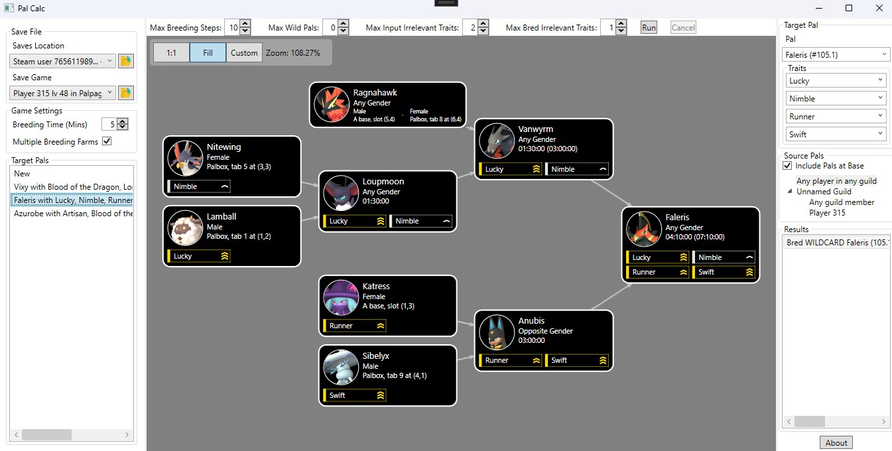

# Pal Calc

_v1.4.3 screenshot_

**Fixed for Sakurajima update!**

Pal Calc is a Windows program for calculating the optimal steps to breed a specific pal with a specific set of traits:

- Can detect and read from your local game save files, based on [palworld-save-tools by cheahjs](https://github.com/cheahjs/palworld-save-tools)
- Supports local Steam saves and Xbox saves
  - Xbox saves are synced to your PC by downloading the game through the ['Xbox' app on Windows](https://apps.microsoft.com/detail/9mv0b5hzvk9z) and running the game at least once. Save files are synced when the game is run.
- Provides time estimates on each step, based on probabilities and mechanics [derived by /u/mgxts in this Reddit post](https://www.reddit.com/r/Palworld/comments/1af9in7/passive_skill_inheritance_mechanics_in_breeding/)
  - Gender probabilities
  - Probability of directly- and randomly-inserted traits
  - For directly-inherited traits, probability of getting the desired traits
- Offers the optimal path
  - Determines "path efficiency" based on calculated probabilities, not just the total number of steps
  - Handles single-root paths, where you successively breed children with another pal you own (one "starting point")
  - Handles multi-root paths, where two children are bred (multiple "starting points")
- Flexible search process
  - Allows wild pals
  - Set a max number of undesired traits if you're ok with imperfect pals
  - Set limits on the number of breeding steps
  - Choose which pals you want to include by filtering by guilds and players
- Efficient
  - Low memory usage and fast load times
  - Relatively fast path-solving process, searches take under a minute
  - Distributes path-solving work across all available CPU cores

# Community Help

Pal Calc currently has some outstanding pieces that need more information to resolve. Some of these need some level of reverse engineering, but some can be figured out through experimentation and statistics. An [issue](https://github.com/tylercamp/palcalc/issues) has been created for each item, where more information can be found.

1. Is there a formula for how long breeding takes? Or is it a constant five minutes? [Issue](https://github.com/tylercamp/palcalc/issues/2)
2. What's the probability of wild pals having exactly N traits? [Issue](https://github.com/tylercamp/palcalc/issues/4)
3. Do child pals _always_ inherit at least one of the parent's traits? [Issue](https://github.com/tylercamp/palcalc/issues/5)
4. How is data mining performed to extract the pal stats necessary for breeding calculations? [Issue](https://github.com/tylercamp/palcalc/issues/6)
5. Has the trait inheritance calculation changed since /u/mgxts reverse engineered it? Was their reverse engineering accurate? [Issue](https://github.com/tylercamp/palcalc/issues/7)
6. Assuming the trait inheritance calculation is correct, is Pal Calc's implementation of those probabilities correct? [Issue](https://github.com/tylercamp/palcalc/issues/8)
7. How can we derive the map coordinates for a base from its world coordinates? [Issue](https://github.com/tylercamp/palcalc/issues/9)
8. What's a good way to estimate time needed to capture a wild pal of a certain type? e.g. Chikipi would be much faster to find + catch than Paladius. [Issue](https://github.com/tylercamp/palcalc/issues/10)

# Development

Visual Studio Community 2022 is required. The `.CLI` projects act as test programs which can be ran without involving the whole Pal Calc UI.

## Palworld Database

The list of pals, traits, and stats are stored in a `db.json` file embedded in `PalCalc.Model`. This file is generated by the [`PalCalc.GenDB`](./PalCalc.GenDB/) project. Running this project will update the `db.json` file in `PalCalc.Model` which will be used by the rest of the projects. The input files for this, stored under `PalCalc.GenDB/ref`, can be manually modified to include entries for new pals and stats if needed.

The `db.json` file should _not_ be modified manually. It should be modified by changing the contents of `PalCalc.GenDB` and re-running the program to regenerate it.

Pal icons are scraped using the `FetchIcons/fetch.js` program which can be ran using NodeJS. This will use https://palworld.gg to collect the high-resolution version of each pal icon as a separate file.

## Save File Support

Save file parsing is in `PalCalc.SaveReader`, which is a partial C# port of [palworld-save-tools](https://github.com/cheahjs/palworld-save-tools). See the project's [README](./PalCalc.SaveReader/) for more information.

## Data and Solver Model

Data collected from Palworld or a save file are represented by types in `PalCalc.Model`. Instances of an owned pal within the game are represented by `PalInstance`.

The solver logic in `PalCalc.Solver` wraps this type with `IPalReference` types, which can represent owned, wild, and bred pals. The `IPalReference` types are returned by `PalCalc.Solver.BreedingSolver`, but you can use `OwnedPalReference` results to fetch underlying owned instances.

## Pal Calc UI

The general structure of the `PalCalc.UI` project is somewhat messy. The application uses WPF and (weak) MVVM for handling its UI. MVVM was largely followed for convenience and it was not strictly adhered to. There are various hackfixes since many features were unplanned and added through the path of least resistance. Refactoring is planned and gladly accepted.

Entries in the `Resource` folder are set to the `Resource` build action and embedded in the final program.

The Community Toolkit library is used for the viewmodels, which provides the `ObservableObject`, `ObservableProperty`, and other utilities. These use code generation to automatically implement `private` fields annotated with `[ObservableProperty]` as `public` properties with the appropriate `INotifyPropertyChanged` logic.

`GraphSharp`, a defunct library [preserved after the Codeplex shutdown](https://github.com/NinetailLabs/GraphSharp), does not have any documentation. It was added here by referencing [hollowdrutt's implementation](https://github.com/hollowdrutt/GraphSharpDemo) of a useful overview/walkthrough of its usage [by Sacha Barber](https://sachabarbs.wordpress.com/2010/08/31/pretty-cool-graphs-in-wpf/).

## TODOs
- Notify when a pal involved in a breeding path is no longer available in the source save or has been moved
- Allow filtering of which wild pals may be included
- Update PalDB reference data for recent game updates
  - Figure out reliable process for updating DB.json with latest pal + trait info (where can I find a frequently-updated source of all required info?)
- General UI/UX improvements
- Optimize app startup time
  - Seems to largely be due to JSON deserialization overhead
- Avoid the current default behavior of clearing out old files if there are incompatibilities, ignore and/or preserve a .bak file instead

## Maybe TODOs
- Automatically detect changes to save file + reload
- Option to auto-recalc all target pals when changes are detected
- Allow specifying custom db.json
- IV inheritance + solving
- Attack skill inheritance + solving
- Figure out how the data miners do their thing and read Pal DB info straight from game files?
- Allow solving for multiple pals at once
- Add a sort of "pal search" feature, listing all owned pal instances which have some traits / pal type
- Implement proper graph diffing for the built in GraphSharp animations
